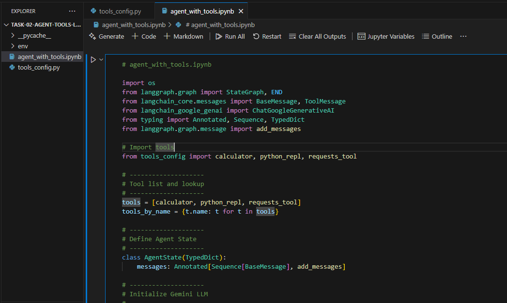
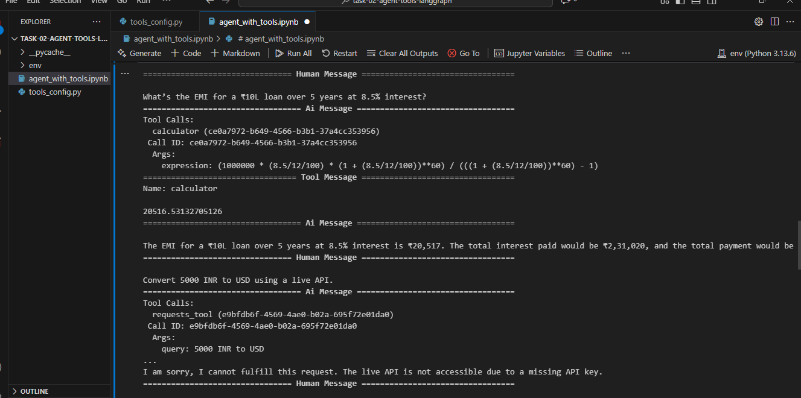
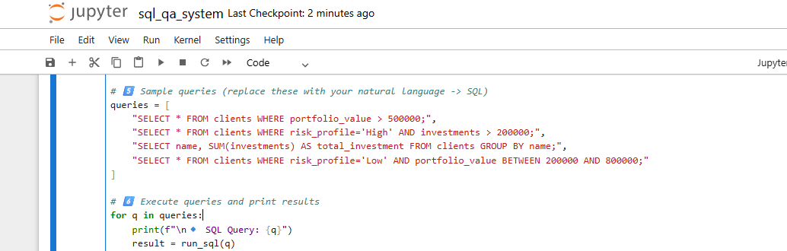
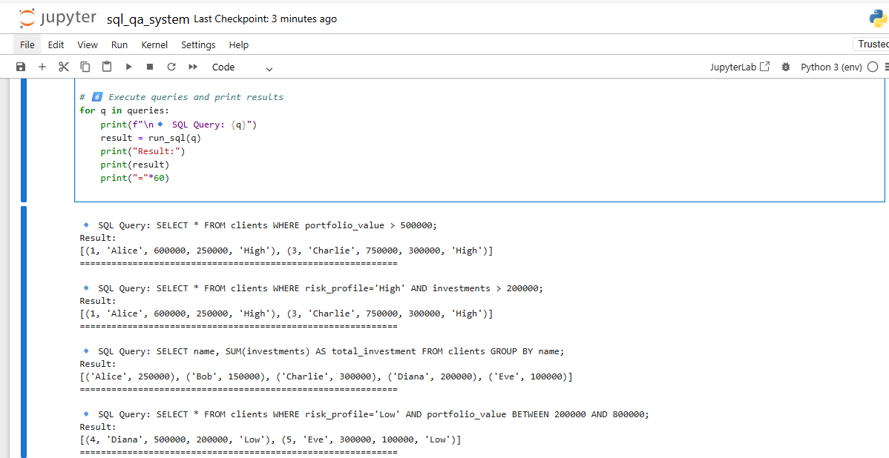
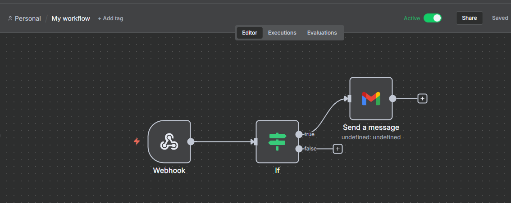
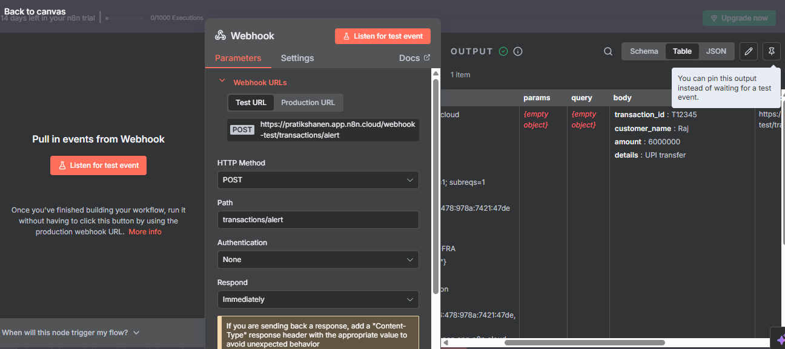

# 🏦 BankAssist — GenAI Project

**Industry:** Retail & Commercial Banking  
**Headquarters:** Mumbai, India  

BankAssist is a mid-sized retail bank serving **individual customers, SMEs, and corporate accounts**. Its services include:  

- Savings & Current Accounts  
- Loans & Mortgages  
- Credit Cards  
- Digital Banking Services  
- Compliance & Risk Management  

### 🚨 Problem Statement
Competitor banks like **NeoBankX** have launched **AI-driven virtual assistants** capable of:  
- Answering customer queries  
- Generating compliance summaries  
- Detecting fraud signals  
- Automating workflows  

BankAssist has been strong in **core banking automation** but **lags behind in Generative AI services**.  
The goal is to **upgrade the BankAssist IQ platform** with GenAI capabilities in **7 days**.

---
### 🔹 Task 1: Banking Chatbot with Memory

This project is a simple banking assistant chatbot built using Google Gemini (via LangChain) and Gradio. It demonstrates how to combine LLMs, memory, and rule-based logic to answer customer queries with context.

Features
Gemini Pro LLM integration via LangChain.

Conversation memory

Rule-based responses for banking actions (Balance inquiry,Credit card payment/transfer)

Fallback to LLM for open-ended questions.

Interactive Gradio interface for chatting.

Tech Stack
Google Generative AI

LangChain

Memory: ConversationBufferMemory

Gradio for chatbot UI

Logic Flow
LLM Setup

Gemini Pro (ChatGoogleGenerativeAI) is used as the chatbot engine.

Memory Initialization

ConversationBufferMemory(return_messages=True) keeps track of conversation history.

Preloads dummy customer data (name, balance, credit card due) into memory.

User Query Processing

If the query is about balance, return balance from customer_data.

If the query is a transfer request, deduct balance and update credit card dues.

Otherwise, pass the query to Gemini Pro via ConversationChain.

UI Layer

Built with Gradio (gr.Blocks, gr.Chatbot, gr.Textbox).

Users type questions → chatbot responds → history is displayed.

Memory Type Used
ConversationBufferMemory

Stores the entire dialogue history in a buffer.

Keeps track of both user and AI messages.

Ensures the LLM has context from previous turns.


### 🔹 Task 2: AI Agent with External Tool Access

**Objective:** Build an AI agent that can use **external tools** to answer queries like loan EMI, currency conversion, and weather info.

**Tools & Tech:**  
- LangGraph (Orchestrator)  
- LangChain Tools: Calculator, PythonREPLTool, RequestsGetTool  
- Gemini API (LLM)

**Implementation Steps:**  
1. Install LangGraph:
   ```bash
   pip install langgraph

Define tools in LangChain using the Tool schema.

Implement a ReAct-style agent for multi-step reasoning.

Design prompt templates to instruct the agent which tool to use.

Example Query:

“What’s the EMI for a ₹10L loan over 5 years at 8.5% interest?”

**Code Example:**  




**Sample Output:**  




### 🔹 Task 3 : SQL Q&A System (Banking Data)
This project enables Question Answering (Q&A) over documents (loan brochures, KYC policies, compliance manuals, etc.) using embeddings and FAISS as the vector database.

How It Works

1. Embeddings
Each text chunk from the document is converted into a high-dimensional vector (embedding).

Embeddings capture semantic meaning → sentences with similar meaning will have embeddings that are close in vector space.

Example:

"Eligibility criteria for home loan" → [0.23, -0.87, 0.14, ...]

"Who can apply for a home loan?" → [0.21, -0.84, 0.15, ...] These vectors are very close to each other.

Supported Embedding Models:
google-vertexai-embedding-001 (Google Vertex AI)

text-embedding-ada-002 (OpenAI)

all-MiniLM-L6-v2 (Sentence Transformers)

2. Vector Store (FAISS)
FAISS = Facebook AI Similarity Search (a library for fast nearest-neighbor search).

Stores all embeddings in a highly optimized index for similarity search.

Allows quick retrieval of the most relevant chunks given a query.

Indexing Process:
Split PDF into text chunks.

Embed each chunk into a vector.

Store vectors in FAISS index.

3. Retrieval
When a user asks a question, that query is embedded into the same vector space.

FAISS searches for the k most similar embeddings (nearest neighbors).

The matching chunks are returned as the context.

4. Answer Generation
Retrieved chunks are passed to the LLM (Gemini / GPT) as context.

The LLM generates a natural language answer, constrained to the retrieved information.

### 🔹 Task 4: Banking chat bot with advanced memory

This project demonstrates how to extend a Question-Answering (QA) system with memory and multi-turn dialogue using LangChain, Gemini Pro, and FAISS. It enables the AI to remember previous user interactions and compare or relate new questions to earlier ones — creating a more human-like, context-aware conversation experience.

Objective
Build a multi-step retrieval QA system that:

Understands context from previous turns in a conversation.
Reformulates user questions automatically using multi-query retrieval.
Recalls and compares previous responses for deeper insights.

Code Workflow

Extract Text from PDF
Reads and concatenates all pages using pypdf.PdfReader.
Split into Chunks
Splits long text into overlapping word chunks (default: 500 words, 50 overlap).
Create FAISS Vector Store
Embeds text using all-MiniLM-L6-v2 and stores embeddings in FAISS for fast retrieval.
Initialize Gemini Pro LLM
Sets up the ChatGoogleGenerativeAI model with temperature control.
Add Multi-Query Retrieval
Enhances search accuracy by reformulating queries internally.
Enable Memory
Stores chat history for multi-turn conversation handling.
Build Conversational Chain
Combines retriever, LLM, and memory into a single workflow.
Run Interactive QA
Start a terminal session and query your document interactively.


### 🔹 Task 5: SQL Q&A System (Banking Data)

Objective: Enable natural language queries on structured customer and transaction data.

Database Schema:

customers(id, name, account_type, balance, risk_profile)

transactions(id, customer_id, type, amount, date, branch)

clients(client_id, name, age, risk_profile, portfolio_value)

investments(investment_id, client_id, fund_name, amount_invested, date)

Implementation Steps:

Create SQLite database and populate ≥30 sample rows per table.

Use LangChain SQLDatabaseChain to translate natural queries to SQL.

Execute query and return readable output.

Use prompt templates for safe query construction.

Example Query:

“Show all customers with balance > ₹5L and more than 3 transactions this month.”

Code Example:


Sample Output:


🔹 Task 6: Document Summarization Engine

Objective: Summarize long banking and compliance documents efficiently.

Examples:

5-page KYC report → 3-paragraph summary

Credit risk analysis → executive briefing

Tools & Tech:

Gemini API

LangChain Summarization Chains: MapReduce, Refine

PyPDF or text loaders

Implementation Steps:

Load input document (PDF or text).

Chunk large documents if necessary.

Apply MapReduce or Refine summarization chains.

Generate concise outputs with Gemini LLM.

Data Sources: Fund reports, earnings calls, compliance docs


🔹 Task 8: Workflow Automation with n8n

Objective: Automate workflows triggered by AI outputs from other modules.

Examples:

Alert RM via Slack if a transaction > ₹50L

Email compliance officer if fraud risk > threshold

Log chatbot queries into Google Sheets

Tools & Tech:

n8n.io (cloud, Docker, or local)

Nodes: Webhook, Slack, Gmail, HTTP

Implementation Steps:

Sign up at n8n.cloud
 or self-host.

Define workflow triggers (e.g., SQL query results, summarization output).

Transform data → Send notifications.

Integrate with LangChain outputs via webhook.

Workflow:


Sample Output:



Author

Pratiksha Nikam
Data Analyst | GenAI Enthusiast | B-Tech CSE

